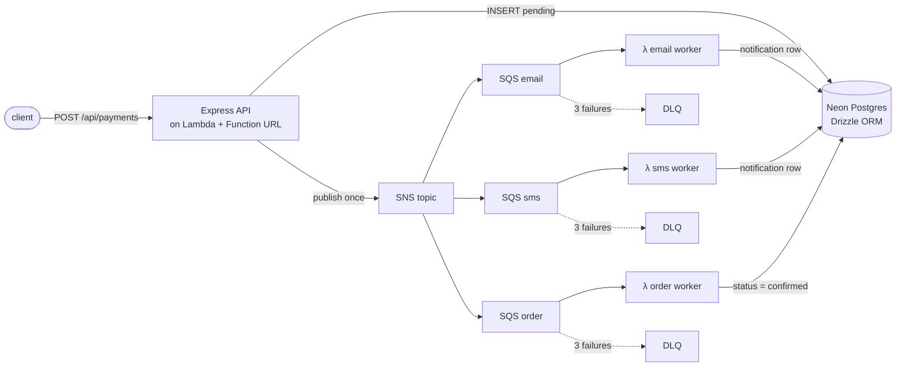

# Resilient Notification System

**Event-driven payment notifications on AWS, fully serverless, deployed by CI with a plan-on-PR / apply-on-merge pipeline and one isolated stack per environment (and per developer).**

[](https://github.com/amaben2020/resilient-notification-system/actions/workflows/deploy-staging.yml)
[](https://github.com/amaben2020/resilient-notification-system/actions/workflows/deploy-prod.yml)
[](https://github.com/amaben2020/resilient-notification-system/actions/workflows/ci.yml)

A payment is accepted once, **one** event is published, and three independent workers react to it: email, SMS, and order confirmation. Each has its own queue, its own retry budget and its own dead-letter queue, so a slow SMS provider can never delay an order confirmation.



## Try it (live)

| Environment | Base URL | Deployed from |
|---|---|---|
| **Production** | `https://hyo24qwiixpi6t2glwovulpqtu0nvxdh.lambda-url.eu-west-2.on.aws` | `master` |
| **Staging** | `https://x57uwocfqijsvt6vau7w6d4q7q0msajh.lambda-url.eu-west-2.on.aws` | `staging` |
| Dev (per developer) | printed by the **Dev stack** workflow when a developer runs `up` | `dev-<name>` |

```bash
BASE=https://x57uwocfqijsvt6vau7w6d4q7q0msajh.lambda-url.eu-west-2.on.aws

curl $BASE/health
# {"ok":true}

curl -X POST $BASE/api/payments -H 'content-type: application/json' \
     -d '{"userId":"you","amount":2500}'
# {"transactionId":"txn_...","status":"pending", ...}

# ~5 seconds later: the order worker flipped the status, the email + sms workers wrote their rows
curl $BASE/api/payments/txn_...
# {"status":"confirmed","notifications":[{"channel":"sms",...},{"channel":"email",...}]}
```

Testing costs nothing: every component is pay-per-use and idles inside the AWS free tier
(the two environments together cost about **$0.50 / month**, almost all of it SQS long-polling).

## What is in here

| Concern | How it is handled |
|---|---|
| Fan-out | SNS topic -> one SQS queue per consumer. Adding a consumer is one more subscription, no API change. |
| Failure isolation | Per-queue visibility timeout, 3 retries, then a dead-letter queue. Workers **rethrow** so SQS retries instead of losing the message. |
| Infrastructure | Terraform: `for_each` over workers, S3 remote state with lockfile, one state key per stack, `source_code_hash` so code changes redeploy. |
| Delivery | GitHub Actions reusable workflow: `fmt -> init -> validate -> plan` on every PR, `migrate -> apply -> integration test -> smoke test` on merge. Staging and prod are separate stacks; developers get their own via `workflow_dispatch`. |
| Database | Neon Postgres over HTTP (`neon-http`), so Lambdas need no connection pool. Drizzle schema + committed SQL migrations. Optional Neon **branch** per developer stack. |
| Observability | pino structured logs with named events (`EVENT_PUBLISHED`, `QUEUE_MESSAGE_RECEIVED`, `ORDER_CONFIRMED`, ...) correlated by `transactionId`; Prometheus metrics at `/metrics`. |
| Tests | 24 offline tests (vitest + supertest: validator, envelope parser, service, workers, HTTP layer) and 2 real-AWS integration tests that publish to the topic and assert all three workers wrote to the database. They run after every apply. |
| Security | Least-privilege CI policy scoped to `notif-system-*` ARNs, separate Lambda execution roles (API can publish, workers can only read their queue), secrets in GitHub environments and SSM, nothing in the repo. |

Full walkthrough with diagrams, design decisions and the failures met along the way: **[tutorial.md](tutorial.md)**.

## Repository layout

```
app.js / server.js                Express app (also the Lambda API via src/api)
src/
  api/index.mjs                   serverless-http wrapper -> Lambda Function URL
  config/                         Drizzle client, schema, migration runner
  features/payment-service/       route -> validator -> controller -> service -> repository
  features/workers/{email,sms,order}/   SQS-triggered Lambda handlers
  observability/                  pino logger, prom-client metrics
scripts/                          esbuild bundler, smoke test, Neon branch helper
tests/{unit,api,integration}/     vitest
drizzle/                          generated SQL migrations (committed)
terraform/                        main.tf, api.tf, observability.tf, environments/, bootstrap/
.github/workflows/                terraform.yml (reusable), deploy-staging, deploy-prod, ci, dev-stack
```

## Run locally

```bash
cp .env.example .env         # DATABASE_URL, PAYMENT_CONFIRMED_TOPIC_ARN (staging topic is fine)
npm install
npm run db:migrate
npm run dev                  # http://localhost:3300, pretty logs
npm test                     # offline: unit + API
npm run smoke                # POST a payment, wait for the workers
npm run test:integration     # real AWS + Neon
```

## Branch flow

`dev` (tests only) -> PR into `staging` (plan) -> merge (apply to staging) -> PR into `master` (plan) -> merge (apply to prod).
Personal stacks: Actions -> **Dev stack** -> `developer=<name>`, `action=up|down`.

## Tear down

Everything is Terraform-managed. To remove an environment:

```bash
npm run build:workers
cd terraform
terraform init -backend-config=environments/backend.hcl -backend-config="key=prod/terraform.tfstate"
terraform destroy -var-file=environments/prod.tfvars
```

Re-creating it is a push to the branch. Dev stacks are removed with the workflow's `action=down`.
