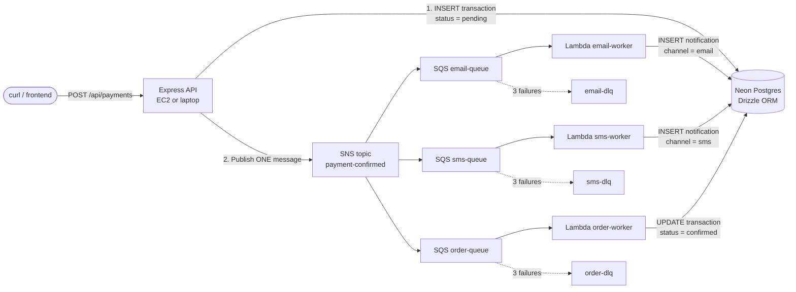
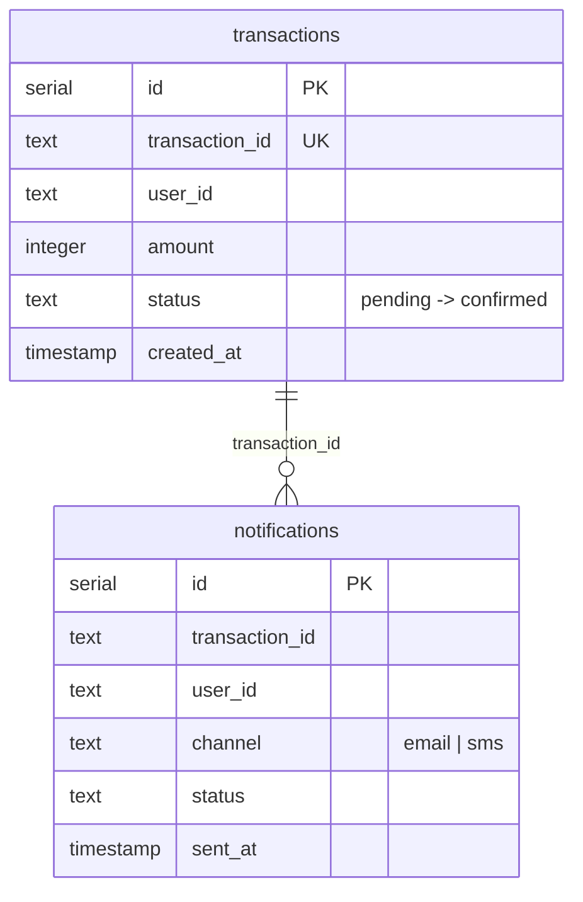
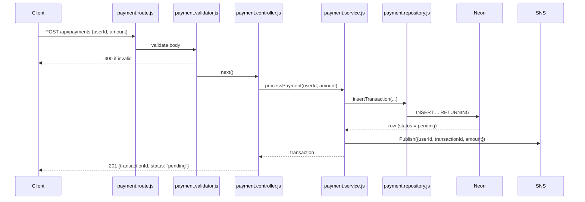
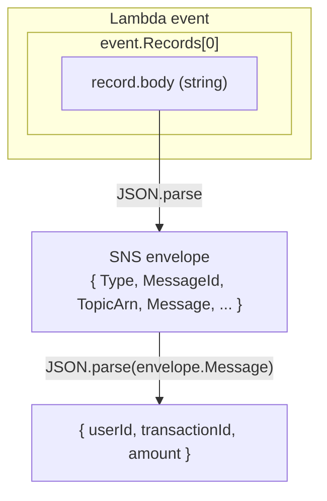
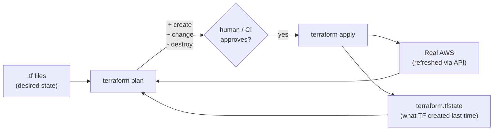
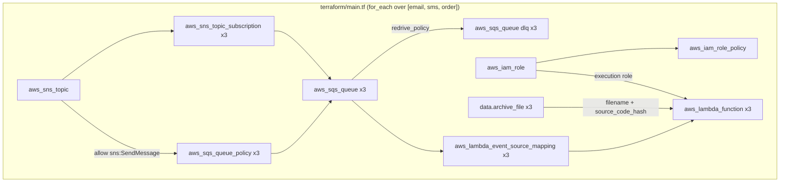
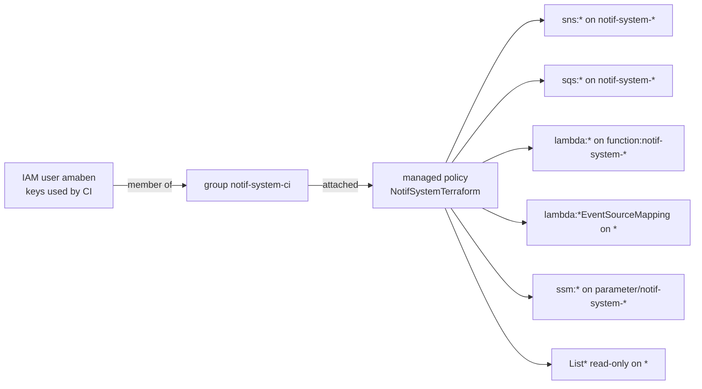
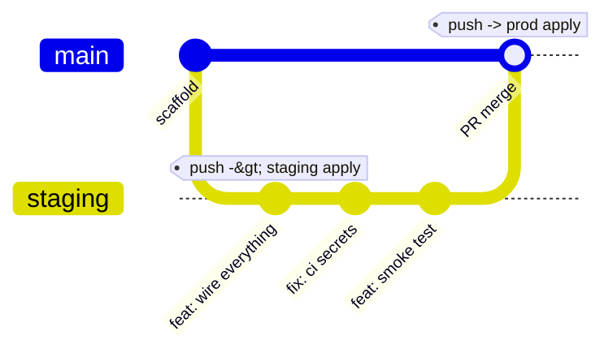
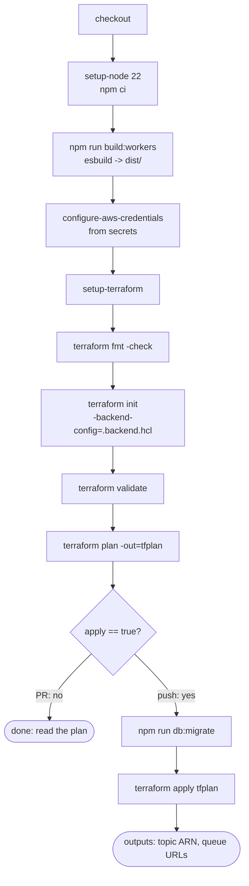

# notif-system: from empty scaffold to a deployed event-driven pipeline

A payment comes in, one event is published, and three independent workers
react to it. This document walks through how the system was built, how the
infrastructure is provisioned with Terraform, how GitHub Actions deploys it,
and every real failure hit along the way (with the fix).

---

## 1. What we built



Why this shape:

| Decision | Reason |
|---|---|
| SNS in front of SQS (fan-out) | The API publishes **once**. Adding a fourth consumer (push notifications, analytics) is one more subscription, zero API changes. |
| One SQS queue per worker | Each worker fails, retries and scales independently. A slow SMS provider never delays order confirmation. |
| Dead-letter queue per queue | After 3 failed attempts a message is parked, not lost. You can inspect and replay it. |
| Lambda for workers | Short, stateless, event-triggered. No servers to keep alive for something that runs for 200 ms. |
| Neon over HTTP (`neon-http` driver) | Each query is an HTTPS request, so there is no connection pool to exhaust from hundreds of concurrent Lambdas. Same client works in Express and Lambda. |

---

## 2. Repository layout

```
notif-system/
├── app.js / server.js                Express app + graceful shutdown
├── src/
│   ├── config/
│   │   ├── schema.js                 Drizzle table definitions
│   │   ├── db.js                     Drizzle client (neon-http)
│   │   └── migrate.js                applies ./drizzle/*.sql
│   ├── features/
│   │   ├── payment-service/          route -> validator -> controller -> service -> repository
│   │   └── workers/
│   │       ├── parse-record.mjs      unwraps SQS body -> SNS envelope -> payload
│   │       ├── email/index.mjs
│   │       ├── sms/index.mjs
│   │       └── order/index.mjs
│   └── observability/metrics.js      prom-client counters + /metrics
├── scripts/
│   ├── build-workers.mjs             esbuild: one bundle per worker -> dist/<worker>/index.mjs
│   └── smoke-test.mjs                POST a payment, poll until workers finish
├── drizzle/                          generated SQL migrations (committed)
├── terraform/
│   ├── main.tf                       SNS, SQS, IAM, Lambda, event source mappings
│   ├── observability.tf              SSM parameter for Grafana key
│   ├── variables.tf
│   ├── environments/                 <env>.tfvars + <env>.backend.hcl
│   └── bootstrap/                    one-time setup Terraform cannot do itself
└── .github/workflows/
    ├── terraform.yml                 reusable pipeline
    ├── deploy-staging.yml            calls it for staging
    └── deploy-prod.yml               calls it for prod
```

---

## 3. Step by step: application code

### 3.1 Database layer (Drizzle + Neon)

**Schema** (`src/config/schema.js`): two tables.



**Client** (`src/config/db.js`):

```js
const sql = neon(process.env.DATABASE_URL);
export const db = drizzle({ client: sql, schema });
```

**Migrations.** The schema is turned into SQL with `drizzle-kit generate`, the SQL
is committed under `drizzle/`, and `src/config/migrate.js` applies whatever has
not run yet (tracked in a `__drizzle_migrations` table).

```bash
npm run db:generate   # after editing schema.js
npm run db:migrate    # apply locally; CI runs the same before terraform apply
```

> **Why not `drizzle-kit push`?** `push` diffs the *entire* database against
> your schema and proposes dropping anything it does not know about. This Neon
> database is shared with another project, and `push` tried to drop that
> project's sequences. `generate` + `migrate` only ever runs SQL you committed.
> `drizzle.config.js` also sets `tablesFilter` as a second guard.

### 3.2 Payment feature

Request flow inside the API:



Each layer has one job: the **validator** rejects bad input, the **controller**
maps HTTP to a function call, the **service** owns the business rule
("persist, then announce"), the **repository** is the only file that knows SQL.

The service also records Prometheus metrics (`payments_processed_total{status}`
and a duration histogram), exposed at `GET /metrics`.

### 3.3 Workers and the double envelope

When SNS delivers to SQS and SQS triggers Lambda, the original payload is
wrapped twice:



That is why `parse-record.mjs` parses twice:

```js
export function parsePaymentEvent(record) {
  const snsEnvelope = JSON.parse(record.body);
  return JSON.parse(snsEnvelope.Message);
}
```

Each worker is ~15 lines: loop over records, parse, do one DB write.

### 3.4 Bundling workers for Lambda

A Lambda zip must contain everything it imports. Instead of a `package.json`
per worker, `scripts/build-workers.mjs` uses esbuild to bundle each worker with
its dependencies (Drizzle, the Neon driver, the shared `db.js`) into a single
file:

```
src/features/workers/email/index.mjs  ─┐
src/config/db.js, schema.js            ├─ esbuild ─> dist/email/index.mjs (~400 KB)
node_modules/drizzle-orm, @neondatabase ┘
```

Output is ESM (`.mjs`) so it runs the same locally and on Lambda; the handler
string `index.handler` resolves to `export const handler` in `index.mjs`.

---

## 4. Step by step: infrastructure with Terraform

### 4.1 How Terraform thinks



Three inputs, one diff. `plan` is read-only and safe to run anywhere. `apply`
executes the diff **and records the result in state**. Lose the state and
Terraform believes nothing exists, so the next apply tries to create
everything again and collides with what is already there.

### 4.2 Resources in `main.tf`



Points that matter:

- **`for_each = toset(local.workers)`** stamps out identical queue/DLQ/Lambda
  sets. Adding a worker = adding one string to the list.
- **`aws_sqs_queue_policy`** is required: SNS is a different principal and SQS
  denies it by default. The policy allows `sqs:SendMessage` only from our topic ARN.
- **`data "archive_file"`** zips `dist/<worker>/` at plan time, and
  `source_code_hash = output_base64sha256` makes Terraform redeploy when the
  bundle changes. Without the hash, code changes would show "no changes".
- **`sensitive = true`** on `database_url` prints `(sensitive value)` in plans.
- **`aws_lambda_event_source_mapping`** is the piece that makes SQS invoke
  Lambda (batch of up to 10 messages per invocation).

### 4.3 Remote state and environments

```hcl
terraform {
  backend "s3" {}   # partial config, filled at init time
}
```

```
environments/staging.backend.hcl        environments/prod.backend.hcl
bucket = "notif-system-tfstate"         bucket = "notif-system-tfstate"
key    = "staging/terraform.tfstate"    key    = "prod/terraform.tfstate"
use_lockfile = true                     use_lockfile = true
```

```bash
terraform init -backend-config=environments/staging.backend.hcl
terraform plan -var-file=environments/staging.tfvars
```

Same code, different state file and different `environment` variable, so every
resource name gets a `notif-system-staging-` or `notif-system-prod-` prefix.
`use_lockfile = true` (Terraform >= 1.10) uses S3 conditional writes for
locking, so no DynamoDB table is needed.

For local plans without the bucket, `terraform/backend_override.tf`
(gitignored) swaps in `backend "local" {}`. Terraform merges any
`*_override.tf` file last.

### 4.4 Bootstrap: the chicken-and-egg part

Terraform cannot create the bucket its own state lives in, nor grant itself
permissions. `terraform/bootstrap/README` holds the one-time commands:

1. Create the versioned, private S3 bucket.
2. Create the customer-managed policy `NotifSystemTerraform` from
   `ci-user-policy.json`, attach it to group `notif-system-ci`, add the CI user.



Why a group: a user may hold at most **10 managed policies** and **2048 bytes
of inline policy** in total; this user was at both limits. Group policies count
against neither.

---

## 5. How CI/CD works

### 5.1 Branch strategy



| Event | Workflow | What runs |
|---|---|---|
| PR into `staging` | deploy-staging | build, plan **only** |
| push to `staging` | deploy-staging | build, plan, migrate, **apply** (staging state) |
| PR into `main`/`master` | deploy-prod | build, plan **only** |
| push to `main`/`master` | deploy-prod | build, plan, migrate, **apply** (prod state) |

### 5.2 The pipeline

Both `deploy-*.yml` files are thin callers of one reusable workflow:

```yaml
jobs:
  staging:
    uses: ./.github/workflows/terraform.yml
    with:
      environment: staging
      apply: ${{ github.event_name == 'push' }}
    secrets: inherit
```



Details worth knowing:

- **`plan -out=tfplan` then `apply tfplan`** applies exactly what was planned,
  not a fresh diff. If AWS changed in between, apply fails instead of doing
  something you did not review.
- **Migrations run before apply** so new Lambda code never meets missing tables.
- **`concurrency: terraform-<env>`** stops two pushes from applying at once.
- **`environment: notif-app`** on the job is the GitHub environment that holds
  the secrets. It is unrelated to the Terraform environment; one GitHub
  environment currently serves both stacks.
- **`secrets: inherit`** is required: a caller evaluating
  `${{ secrets.X }}` runs outside the job's environment, so environment-scoped
  secrets would resolve to empty.

### 5.3 Secrets

| Secret | Used by |
|---|---|
| `AWS_ACCESS_KEY_ID`, `AWS_SECRET_ACCESS_KEY` | Terraform + AWS CLI in CI |
| `DATABASE_URL` | `TF_VAR_database_url` (into Lambda env) and `npm run db:migrate` |
| `GRAFANA_CLOUD_API_KEY` | `TF_VAR_grafana_cloud_api_key` (into SSM), optional |

Terraform reads any `TF_VAR_<name>` environment variable as the variable
`<name>`, which is how secrets reach `variables.tf` without appearing in files.

---

## 6. Running and testing

```bash
cp .env.example .env            # fill DATABASE_URL and PAYMENT_CONFIRMED_TOPIC_ARN
npm install
npm run db:migrate
npm run dev                     # terminal 1
npm run smoke                   # terminal 2
```

`smoke` posts a payment and polls `GET /api/payments/:id` until the order
worker has set `status = confirmed` and both notification rows exist.
Typical result against real AWS: 4-5 seconds.

Manual:

```bash
curl -X POST localhost:3300/api/payments -H 'content-type: application/json' \
  -d '{"userId":"u_1","amount":4999}'
curl localhost:3300/api/payments/<transactionId>
curl localhost:3300/metrics | grep payments_processed
```

Infra:

```bash
npm run build:workers
cd terraform
terraform init -backend-config=environments/staging.backend.hcl
TF_VAR_database_url=... terraform plan -var-file=environments/staging.tfvars
```

---

## 7. Failures we actually hit, in order

Every one of these is a normal part of standing up a pipeline. Knowing the
symptom -> cause mapping is most of the job.

| # | Symptom | Cause | Fix |
|---|---|---|---|
| 1 | `drizzle-kit push` prompts about renames, then tries to `DROP SEQUENCE users_id_seq` | Shared database; `push` diffs everything | Switch to `generate` + `migrate`; add `tablesFilter` |
| 2 | `module is not defined in ES module scope` when loading worker bundle | esbuild emitted CJS into a `.js` file under `"type": "module"` | Emit ESM `.mjs` |
| 3 | `terraform plan` -> `Backend initialization required` after `init -backend=false` | `-backend=false` allows `validate` but not `plan` | Gitignored `backend_override.tf` with `backend "local" {}` |
| 4 | `dist/` ended up staged in git | Original `.gitignore` had no trailing newline; append glued onto `*.tfstate` | Rewrite `.gitignore` |
| 5 | `configure-aws-credentials` fails, secrets empty | Secrets were in GitHub environment `notif-app`, job declared `staging`; also caller passed secrets explicitly | `environment: notif-app` + `secrets: inherit` |
| 6 | `The security token included in the request is invalid` | Key pair in secrets did not match the only active key on the IAM user | Re-paste both values from `~/.aws/credentials` |
| 7 | `not authorized to perform: SNS:CreateTopic` (and SQS, Lambda, SSM) | User only had IAM + S3 access | Scoped policy `ci-user-policy.json` |
| 8 | `Maximum policy size of 2048 bytes exceeded for user` | Inline policy cap | Customer-managed policy attached via group |
| 9 | Policy attached, simulator says allowed, Lambda still 403 | **IAM propagation lag**, per service (SNS/SQS instant, Lambda/SSM minutes) | Poll the real API call before re-running |
| 10 | `lambda:ListTags on event-source-mapping:...` denied after functions created | Event source mappings have their own ARN shape, not `function:` | Add statement for `event-source-mapping:*` |
| 11 | Console shows nothing in eu-west-2 | `List*` APIs cannot be resource-scoped; policy had none | Read-only `ListFunctions`/`ListQueues`/`ListTopics` on `*` |

The pattern behind 7-11: read the `AccessDenied` message literally. It names
the exact action and the exact resource ARN to add.

### Partial applies are fine

Runs 7, 9 and 10 each failed mid-apply. Nothing needed cleaning up: whatever
was created is in the S3 state, so the next run planned only the remainder
(`22 -> 21 -> 6 -> 3 to add -> No changes`). That is the practical payoff of
remote state.

---

## 8. Glossary

| Term | Meaning here |
|---|---|
| Fan-out | One publish, N deliveries. SNS -> N SQS queues. |
| DLQ | Dead-letter queue. Where a message goes after `maxReceiveCount` failures. |
| Event source mapping | The Lambda-side resource that polls an SQS queue and invokes the function. |
| Visibility timeout | How long SQS hides a message while a consumer works on it (60 s here, must exceed Lambda timeout of 30 s). |
| State | Terraform's record of what it created. Lives in S3 for this project. |
| Plan / apply | Diff / execute-the-diff. |
| `for_each` | Terraform loop; produces `resource["email"]`, `resource["sms"]`, ... |
| Reusable workflow | A GitHub Actions workflow with `on: workflow_call`, invoked by other workflows via `uses:`. |
| GitHub environment | A named bag of secrets and protection rules a job can target. |
| `TF_VAR_x` | Environment variable Terraform reads as input variable `x`. |
| neon-http | Neon's driver that sends each SQL statement as an HTTPS request. No sockets, no pool. |
